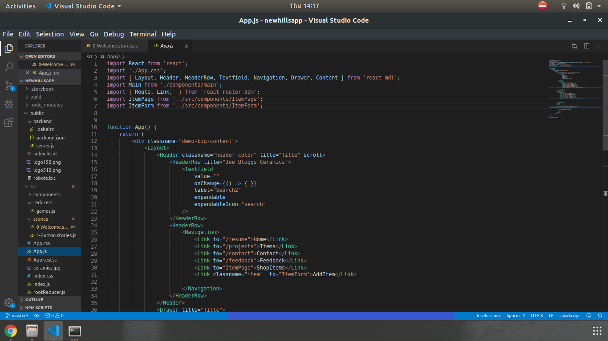
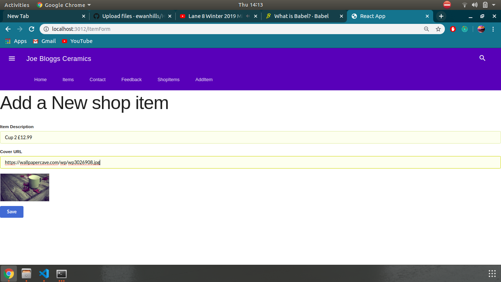

# Project Title
Ewan Hills React application for a ceramics producer.

## Overview
This is a react application that allows a shopowner to add items to his her shop. These items can then be later be viewed via a shop item page. The owner can add, edit, delete as well as save more items to the shop. If the user provides a url an image can be added to the items description.

Mongodb, node js, ajax and babelrc for backwards compatability are used. The shop items are fetched from the mongodatabase. If no items are present in the database then a message saying so will be displayed.

The application has hyperlinking,
Error detection such as error codes for network errors,
Input validation at the API level,
Crud Support,
Routing,
Storybook Integration,
Paramatarized Urls,
Header Footer Navigation,
Backend Integration via Json Server,


## Getting Started

These instructions will get you a copy of the project up and running on your local machine for development and testing purposes. See deployment for notes on how to deploy the project on a live system.

The user will then go into the  backend folder and open 2 terminals.
IN TERMINAL 1, the user will input mongod to start to mongo service.
IN TERMINAL 2, the user will input npm start, now to applcation will listen out to port 8080 for requests.


### Some screenshots of the application

## Starting Backend


## Routing




## Shop & Add Items CRUD





## Json server error detection example


### Installing

A step by step series of examples that tell you how to get a development env running

Say what the step will be

```
See if node.js is installed by typing "node -v"
if node.js is not installed follow these instructions 

for UBUNTU/LINUX       https://docs.npmjs.com/cli/install
for WINDOWS machines   https://yarnpkg.com/lang/en/docs/install/#debian-stable
```


End with an example of getting some data out of the system or using it for a little demo

## Running the tests

Download the repo, go into the newhillsreatapp, then open a terminal.

If your using windows type "yarn run"

if on Ubuntu/Linux type "npm run"


## Built With

* Help from labs
* Help from the following playlists "https://www.youtube.com/watch?v=Ej3VPf-BrYM"
* CRUD help from "https://www.youtube.com/watch?v=HZkN0LfC5dM&list=PLjW0UGS7gVqd9_BfJBkGAEUguPBeJ-LcE&index=2&t=0s"
* CRUD help from https://www.youtube.com/watch?v=h1ivekTEC2M&list=PLuNEz8XtB51KfnHc99GwscPy1UbLJyXHW


## Versioning

I used to Netify "https://www.netlify.com/" an all in one platfrom tool to host my website.

